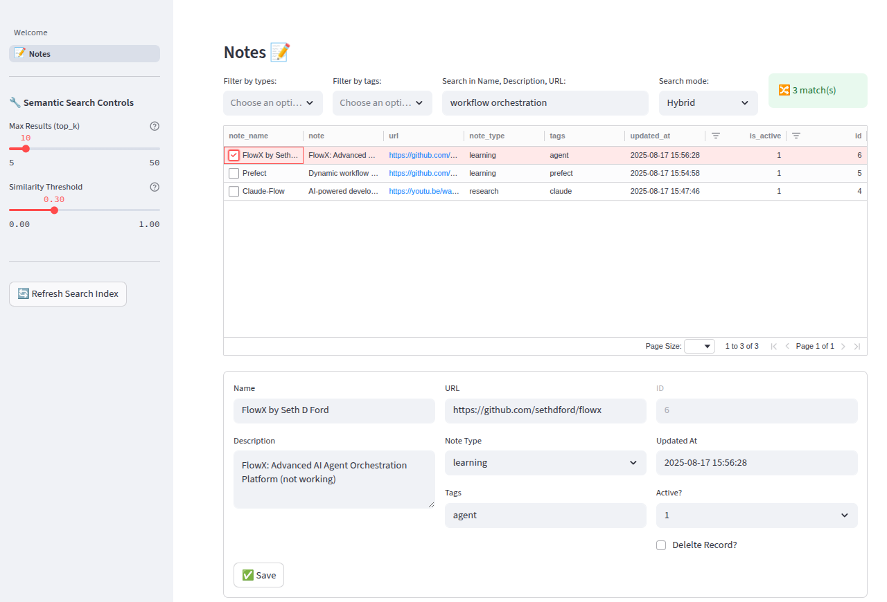

# 📝 Smart Notes - AI-Powered Note Taking App

A modern, intelligent note-taking application built with Streamlit, featuring semantic search powered by FAISS vector store and sentence transformers.

## ✨ Features

### 🔍 **Advanced Search Capabilities**
- **Hybrid Search**: Combines traditional keyword search with AI-powered semantic search
- **Semantic Search**: Understands context and meaning using sentence transformers
- **Keyword Search**: Traditional SQL-based text matching
- **Smart Tag Filtering**: Multi-select filtering with intelligent tag parsing

### 🧠 **AI-Powered Semantic Search**
- Uses `all-MiniLM-L6-v2` model for fast, lightweight embeddings
- FAISS vector store for efficient similarity search
- Automatic index rebuilding on save/update/delete operations
- Context-aware search that finds related content even without exact keyword matches

### 🏷️ **Intelligent Tag System**
- Supports multiple delimiters (commas, spaces)
- Automatic tag parsing and normalization
- Individual tag filtering with multiselect dropdown
- Case-insensitive tag matching

### 💾 **Data Management**
- SQLite database for reliable data storage
- Auto-save functionality with real-time index updates
- CSV export capabilities
- Clickable URL links in note entries

### 🎨 **Clean User Interface**
- Responsive grid layout for note browsing
- Form-based note editing with validation
- Sidebar with advanced options
- Real-time search result feedback

## 🎥 Demo Video

*Coming soon! YouTube demo video will be available here.*

[](https://youtube.com)

## 📸 Screenshots

### Main Interface - Semantic Search in Action

*Semantic search finding "workflow orchestration" matches across different notes - showcasing AI-powered contextual understanding*

### Search Modes
- **🔀 Hybrid**: Best of both keyword and semantic search
- **🧠 Semantic**: AI-powered contextual search  
- **📝 Keyword**: Traditional text matching

## 🚀 Quick Start

### Prerequisites
- Python 3.8+
- Virtual environment (recommended)

### Installation

1. **Clone the repository**
   ```bash
   git clone <repository-url>
   cd st_note
   ```

2. **Create and activate virtual environment**
   ```bash
   python -m venv venv
   source venv/bin/activate  # On Windows: venv\Scripts\activate
   ```

3. **Install dependencies**
   ```bash
   pip install -r requirements.txt
   ```

4. **Initialize the database and vector index**
   ```bash
   # Run the migration script to build initial FAISS index
   python src/migrate_vector_index.py
   ```

5. **Launch the application**
   ```bash
   streamlit run src/Welcome.py
   ```

6. **Access the app**
   - Open your browser to `http://localhost:8501`
   - Navigate to the "📝 Notes" page to start taking notes

## 📋 Usage Guide

### Adding Notes
1. Navigate to the "📝 Notes" page
2. Fill in the form with:
   - **Title**: Note name/title
   - **Content**: Main note content
   - **URL/URL2/URL3**: Up to three optional related links
   - **Type**: Note category (learning, research, project, etc.)
   - **Tags**: Space or comma-separated tags
3. Click "✅ Save" - the search index updates automatically

### Searching Notes
1. **Text Search**: Enter keywords in the search box
2. **Tag Filter**: Select specific tags from the dropdown
3. **Search Mode**: Choose between Hybrid, Semantic, or Keyword search
4. **View Results**: Click on any note to edit

### Import/Export Notes
- **📤 Export Notes**: Download search results as CSV with timestamp
- **📥 Import Notes**: Upload CSV files to bulk import notes
  - Required: `note_name` column
  - Optional: `note`, `url`, `url2`, `url3`, `note_type`, `tags`, `is_active`
  - Duplicate detection uses composite key (`note_name` + `note_type`)
  - Options: Skip duplicates or update existing notes
  - Automatic search index refresh after import

### Advanced Features
- **Manual Index Refresh**: Use sidebar button for troubleshooting
- **Tag Management**: View all available tags organized by usage

## 🏗️ Architecture

### Core Components
- **Frontend**: Streamlit with custom UI components
- **Database**: SQLite with structured schema
- **Search Engine**: FAISS vector store + sentence transformers
- **Backend Logic**: Python with pandas for data processing

### File Structure
```
src/
├── Welcome.py              # Main entry point
├── pages/
│   └── 1-📝Notes.py       # Notes page with search & CRUD
├── utils.py               # Core utilities & semantic search
├── ui_layout.py           # UI components & form layouts
├── migrate_vector_index.py # Initial index migration
└── db/
    ├── notes.sqlite3      # SQLite database
    ├── tables_ddl.sql     # Database schema
    └── notes_faiss.index  # FAISS vector index
```

### Database Schema
```sql
CREATE TABLE t_note (
    id INTEGER PRIMARY KEY AUTOINCREMENT,
    note_name TEXT NOT NULL,
    url TEXT,
    url2 TEXT,
    url3 TEXT,
    note_type TEXT DEFAULT '',
    note TEXT,
    tags TEXT,
    is_active INTEGER DEFAULT 1 CHECK(is_active IN (0, 1)),
    created_at TEXT,
    updated_at TEXT,
    created_by TEXT NOT NULL,
    updated_by TEXT
);
```

## 🔧 Configuration

### Embedding Model
- Default: `all-MiniLM-L6-v2` (lightweight, fast)
- Configurable in `utils.py` → `CFG["EMBEDDING_MODEL"]`

### Search Parameters
- Similarity threshold: 0.1 (adjustable in `semantic_search()`)
- Top-K results: 20 (configurable per search)

## 🛠️ Development

### Running in Development Mode
```bash
streamlit run src/Welcome.py --server.headless false
```

### Rebuilding Search Index
```bash
python src/migrate_vector_index.py
```

### Adding New Features
1. Database changes: Update `db/tables_ddl.sql`
2. UI changes: Modify `pages/` or `ui_layout.py`
3. Search logic: Extend functions in `utils.py`

## 📦 Dependencies

### Core Libraries
- `streamlit` - Web application framework
- `pandas` - Data manipulation
- `sqlite3` - Database operations
- `sentence-transformers` - Text embeddings
- `faiss-cpu` - Vector similarity search
- `streamlit-aggrid` - Enhanced data grids

### Full Requirements
See `requirements.txt` for complete dependency list.

## 🤝 Contributing

1. Fork the repository
2. Create a feature branch
3. Make your changes
4. Add tests if applicable
5. Submit a pull request

## 📄 License

This project is licensed under the MIT License - see the LICENSE file for details.

## 🚀 Future Enhancements

### Unified Database Architecture
Future versions could migrate to **PostgreSQL + pgvector** for a unified solution combining both RDBMS and vector capabilities:

- **Single database** instead of SQLite + FAISS
- **Native vector operations** with similarity search
- **Advanced SQL queries** with vector filtering
- **Better scalability** and concurrent access
- **ACID compliance** for data integrity

This would eliminate the dual-storage complexity while maintaining all current functionality.

### Other Potential Features
- Multi-language semantic search support
- Automatic note clustering and categorization  
- Smart note suggestions based on current content
- Real-time collaborative editing
- Advanced analytics and insights

## 🙏 Acknowledgments

- [Sentence Transformers](https://www.sbert.net/) for semantic embeddings
- [FAISS](https://github.com/facebookresearch/faiss) for efficient vector search
- [Streamlit](https://streamlit.io/) for the amazing web framework
- The open-source community for excellent tools and libraries

---

**Built with ❤️ using Claude Code and Streamlit**
